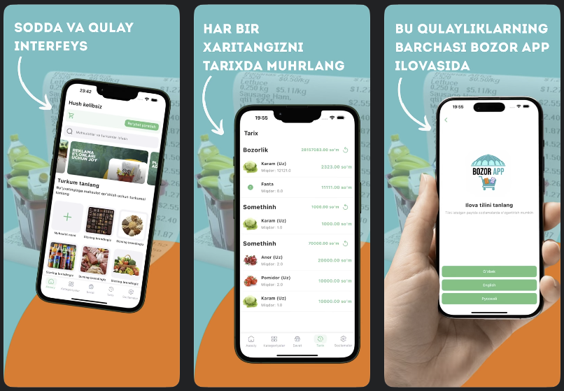

# 📱 Preview

  

# 🛒 Bozor App

**Bozor App (Market App)** is a Flutter-based mobile application designed to make your **daily shopping easier, smarter, and more organized**.  
With Bozor App, you can discover where to find quality products — from groceries and cleaning supplies to clothes, medicines, and even construction materials.

---

## ✨ Features

- 🧾 **Smart Shopping Lists** – Create and manage your shopping list electronically — no more paper or notes.  
- 🏪 **Product Recommendations** – Get suggestions on where to buy quality daily goods at the best prices.  
- ✅ **Check-off System** – Mark products as purchased while shopping to stay organized.  
- 💰 **Expense Tracking** – Instantly see your total spending at the end of every shopping trip.  
- 📂 **Shopping History** – Save your lists for future use and reuse them anytime.  
- 🔗 **Easy Sharing** – Share your shopping list with others (e.g., wife to husband or vice versa).  
- 📊 **Budget Control** – Monitor your expenses and make smarter purchase decisions.  

Bozor App is your **personal shopping assistant**, helping you keep every purchase **efficient, economical, and well-organized**.

---

## 🔗 Download Links

- 📱 [**Play Store**](https://play.google.com/store/apps/details?id=uz.sectorsoft.marketapp)  
- 🍎 [**App Store**](https://apps.apple.com/uz/app/onur-group/id6738658032)

---

## 🛠️ Tech Stack

- **Flutter** – Cross-platform UI framework  
- **Dart** – Main programming language  
- **REST API** – Backend communication  
- **Riverpod & Provider** – State management  

---

## 👨‍💻 About

Developed by **Abduazim Abduqahhorov**, Flutter Developer.  
📍 Uzbekistan | ✉️ [abdukhaxxoroff@gmail.com](mailto:abdukhaxxoroff@gmail.com)
